<p align="center">
  
</p>

<p align="center">
  <b>B.Tech CSE · Symbiosis Institute of Technology, Pune</b><br/>
  <sub>cybersecurity · web · applied ML · poetry</sub>
</p>

<p align="center">
  <a href="https://www.linkedin.com/in/shreya-panda-a7691b320/"></a>
  <a href="mailto:shreyapanda2707@gmail.com"></a>
</p>

> *Building things, breaking things, learning from them, and occasionally writing about them.*

<p align="center"></p>

## 🕯️ Second year, *many doors*

I'm a second-year Computer Science student, and I'm most interested in software that does something real: a simulator that catches an attacker, a model that corrects a drifting sensor, a website that holds a poem.

I split my curiosity between **security**, **software**, **machine learning** and **words**. They look unrelated, but they train the same habit: read closely, notice what doesn't fit, and follow it.

<table>
<tr>
<td width="50%" valign="top">

**🌙 By night, the writer**
- Poetry and creative writing
- Model United Nations
- Public speaking and presentations
- Websites that carry a mood

</td>
<td width="50%" valign="top">

**⌨️ By day, the builder**
- Security tools and simulations
- Web apps and developer utilities
- Practical AI/ML systems
- Data-driven applications

</td>
</tr>
</table>

<p align="center"></p>

## 📚 The archive

Six things I've built or am building. Open any of them for the details.

<details>
<summary><b>🔐 Cyber Incident Simulator</b> &nbsp;·&nbsp; <sub>Python · MITRE ATT&CK · Incident Response</sub></summary>
<br/>

A security incident simulation and investigation platform. It works like an analyst's day compressed into one tool:

1. **Generate** realistic incidents
2. **Correlate** the events that belong together
3. **Detect** suspicious activity
4. **Map** it to **MITRE ATT&CK**
5. **Report**, with an investigation write-up at the end

*Why I built it:* to practise thinking like a responder, not just a coder.
</details>

<details>
<summary><b>🛡️ DepShield AI</b> &nbsp;·&nbsp; <sub>Python · AI/ML · Software supply-chain security</sub></summary>
<br/>

An AI-powered concept for **software supply-chain security**. It aims to identify vulnerable or suspicious dependencies and analyse the potential security impact of third-party packages, so the question stops being "does it work?" and becomes "should I trust it?"
</details>

<details>
<summary><b>🕯️ The Hollow Archive</b> &nbsp;·&nbsp; <sub>HTML · CSS · JavaScript · Canvas</sub></summary>
<br/>

An interactive **dark-fantasy visual novel** written in vanilla HTML, CSS and JavaScript, with no frameworks.
- Branching narratives
- Persistent state
- Interactive effects and atmospheric web design

The place where the writer and the developer share a desk.
</details>

<details>
<summary><b>🧭 AI-ML Intelligent Dead Reckoning System</b> &nbsp;·&nbsp; <sub>AI/ML · Embedded · Sensor fusion</sub></summary>
<br/>

Navigation for places where **GNSS is denied**. It fuses **IMU, wheel-encoder and magnetometer** data and explores machine-learning-based **drift correction**, because dead reckoning gets less accurate the longer it runs.
</details>

<details>
<summary><b>₿ BTC-Adapt</b> &nbsp;·&nbsp; <sub>Python · XGBoost · LSTM · Time series</sub></summary>
<br/>

An **adaptive, regime-aware multi-model framework** for Bitcoin price forecasting. Different market conditions call for different models, so it is built around model evaluation and backtesting, not a single model.
</details>

<details>
<summary><b>📝 Static & Stanza</b> &nbsp;·&nbsp; <sub>HTML · CSS · JavaScript · Netlify</sub></summary>
<br/>

A minimalist **poetry and writing website**, built to combine web development with creative writing. Small on purpose.
</details>

<p align="center"></p>

## 🧰 On my shelves

<p>
  <br/>
  
</p>

| Shelf | What's on it |
|---|---|
| 🔐 **Security** | Digital forensics · Incident response · Security analysis · MITRE ATT&CK · SIEM · Threat detection · Vulnerability analysis · Security automation |
| 🤖 **AI / ML** | Python · Data processing · Exploratory data analysis · Time-series forecasting · XGBoost · LSTM · Model evaluation |
| 🌐 **Web** | HTML · CSS · JavaScript · REST APIs · Frontend, backend and full-stack (exploring) |
| 🗄️ **Data** | SQL · Relational databases · Database design · Joins and subqueries |
| 🧰 **Tools** | Git · GitHub · VS Code · Linux · Windows · VirtualBox · Docker |

<p align="center"></p>

## 🧭 Where I'm headed

```text
🔐 Cybersecurity ──── Digital Forensics · Incident Response · Threat Detection · Security Automation
💻 Software ──────── DSA in C++ · Web · Backend · Developer tools
🤖 AI / ML ───────── Applied ML · Time-series · AI-powered security
🌐 Open source ───── Exploring  →  Contributing  →  Building
```

**Learning right now:** `Data Structures & Algorithms` · `Backend` · `Cybersecurity` · `Digital Forensics` · `DevOps` · `System Design`

**Goals:**
- [ ] Get strong at **C++ and DSA**
- [ ] Build meaningful, **industry-ready** projects
- [ ] Go deeper into **cybersecurity**
- [ ] Make my first **open-source contributions**
- [ ] Explore **backend and full-stack** development
- [x] Keep learning and shipping

<p align="center"></p>

## 🏆 The hackathon trail

<p>
  
  
  
  
  
</p>

Building against a clock is where ideas turn into working software. I've taken part in **Smart India Hackathon 2026**, the **Adobe Hackathon**, the **Navchar Hackathon**, **HackDevengers** and hackathons at **SIT**.

**Beyond hackathons:**
- 🧑‍💻 Open-source exploration
- 🎤 Model United Nations, public speaking and presentations
- ✍️ Poetry and creative writing

<p align="center"></p>

## 📈 The numbers

<p align="center">
  
  
</p>

<p align="center"></p>

## 🤝 Let's build something

I'm open to **internships**, **open-source collaboration** and good conversations about security, software or verse.

<p align="center">
  <a href="https://www.linkedin.com/in/shreya-panda-a7691b320/">LinkedIn</a> &nbsp;·&nbsp;
  <a href="mailto:shreyapanda2707@gmail.com">Email</a>
</p>

<p align="center"><i>Somewhere between debugging code and writing poetry,<br/>I'm still figuring out what to build next.</i></p>
